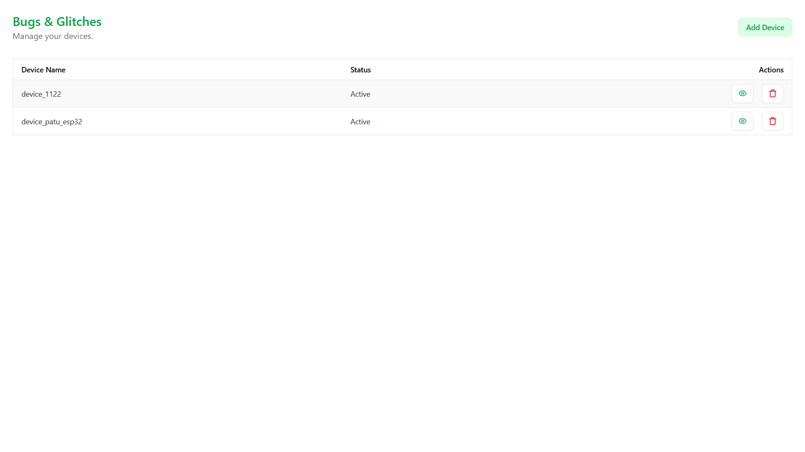
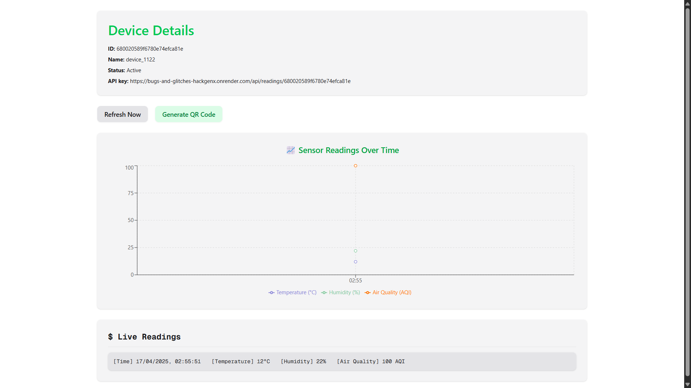
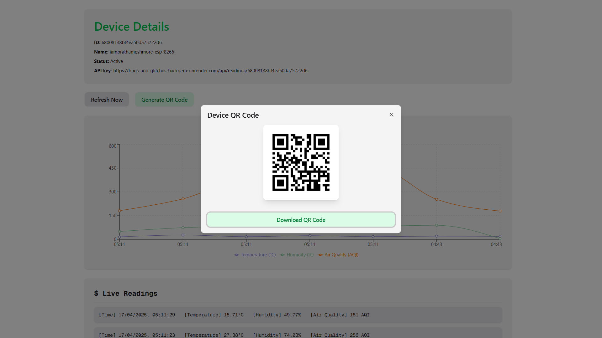
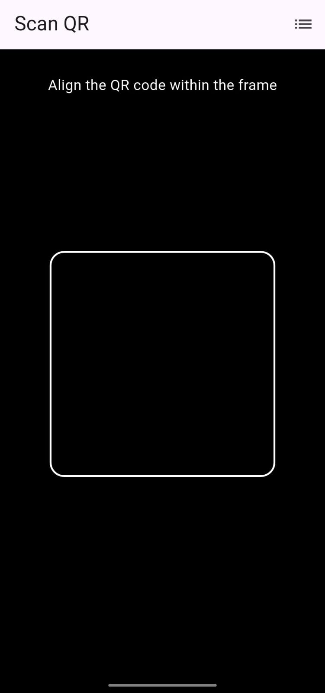
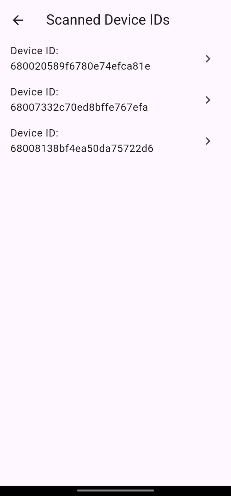

# Smart Pollution Control & Monitoring

This project integrates IoT devices, AI-powered pollution data analysis, real-time monitoring, and notifications for web and mobile platforms.

## Tasks
- **Web App**: Real-time pollution dashboard with Next.js.
- **Mobile App**: Flutter app for real-time monitoring and alerts.
- **IoT**: ESP32-based pollution sensors transmitting data in real-time.
- **Backend**: FastAPI API for data management, AI-based forecasting, and trend analysis.
- **Prediction Model**: AI model for short-term forecasting and anomaly detection.
- **Firebase Notifications**: Real-time alerts for critical pollution levels.

## Links
- **Website**: https://bugs-and-glitches-hackgenx.vercel.app
- **Backend**: https://bugs-and-glitches-hackgenx.onrender.com
- **Mobile App**: https://github.com/iamprathameshmore/Bugs_and_Glitches_hackgenx/tree/dev/app/release

## Screenshots
- **Web Dashboard**:  

- **Mobile App**:

    
    

- **IoT Device**:

    
    

    
Created by <strong>@iamprathameshmore
    </strong>

    

        <a href="https://www.linkedin.com/in/iamprathamesh" target="_blank" style="color: #0077b5; text-decoration: none;">LinkedIn</a> 
        | 
        <a href="mailto:iamprathamesh@example.com" style="text-decoration: none;">Email</a>
    

